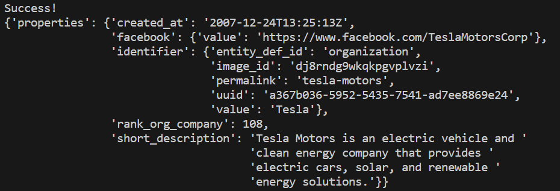

# projectsabisaac
- Sabi Ertovi Isaac Btesh

# Project Proposal: Stock Analysis and Information Tool

## The Big Idea: What is the main idea of your project? What topics will you explore and what will you accomplish? Describe your minimum viable product (MVP) and your stretch goal.
+ We pivoted to build a tool that offers stock market analysis and company information. Utilizing financial data APIs, this tool will allow users to input stock tickers and receive graphs showing stock performance. Additionally, it will use the OpenAI GPT API to provide summaries about the company that was inputted. In out project's interface  users can input stock tickers and receive both visual data analysis and AI-generated company summaries. Our goal is to provide users with analytical tools and advanced financial indicators to make better investment decisions.

## Learning Objectives:
+ **Isaac’s Goals:** Focus on mastering APIs and retreiving information, and integrating AI for more infomation. This aligns with his interest in finance and tech, offering practical skills for his venture capital work.
  
+ **Sabi’s Goals:** Concentrate on building a robust front-end experience and deepening understanding of financial data visualization. 

+ **Mutual Goals:** Enhance our teamwork in coding, particularly in integrating diverse APIs and managing a complex data-centric application.

## Implementation Plan:
We plan to use financial data APIs (like Yahoo Finance) for stock information and OpenAI's GPT for company summaries.
+ Front-end development with Flask and HTML for user input and data display.
+ Utilization of Python libraries for data fetching and processing.
+ Integration with OpenAI's GPT API for textual company data.

## Project Schedule: 

### Timeline:

**Week 1 (Nov 13th-19th)**
+ Understand the structure and capabilities of chosen financial APIs.
+ Set up initial Flask web application and API keys.

**Week 2 (Nov 20th - 26th)**
+ Develop functionality for fetching and displaying stock data.
+ Experiment with data visualization libraries in Python.

**Week 3 (Nov 27th - Dec 3)**
+ Integrate OpenAI's GPT API for company summaries.
+ Start frontend development for displaying data and information.
+ Begin preliminary testing on data accuracy and API reliability.

## Collaboration Plan:
+ We'll work collaboratively, meeting regularly to ensure both team members are engaged in each aspect of the project.
+ Utilize Slack for code sharing and WhatsApp for general communication.
+ Employ pair programming for complex integrations and code reviews for quality assurance.

## Risks and Limitations:
+ Time management and external commitments remain a significant challenge.
+ Ensuring the reliability of data fetched from APIs and the relevance of AI-generated content.
+ Maintaining focus and motivation throughout the project duration.

## Additional Course Content:
+ Advanced data visualization techniques.
+ Effective use of AI APIs for text generation.
+ Optimizing Flask applications for better performance.
+ Enhanced error handling and debugging in a complex application setup.

## Progress and Lessons Learned:
- Our idea was to develop a tool tailored for venture capitalists, utilizing the Crunchbase API to automate the delivery of custom alerts through channels such as email, Slack, Telegram, and Google Spreadsheets. This tool was intended to analyze industry trends over previous years, providing venture capitalists with automated insights into new investment opportunities and market shifts based on specific criteria like country, industry, and investment size.

- In the late stages of our venture capitalist tool project, we learned a crucial lesson about the importance of thoroughly understanding the tools we use. Initially, we planned to use the free version of the Crunchbase API to create a tool for sending custom alerts and analyzing industry trends. However, we discovered that the essential data we needed was only available in the paid version of the API. This setback highlighted the need for in-depth research into the capabilities and limitations of APIs. It was a valuable lesson in not making assumptions about technology and being more cautious and thorough in evaluating external resources for future projects.

- This was the output of our attempt calling the crunchbase API, as we can see it delivered very limited information that was not valuabel to us.



# Advanced Stock Visualization and Analysis Tool - Pivot Project Full Technical Information

## Detailed Overview

- This project is a web-based application designed for stock market ticker data analysis. Leveraging the power of Python and its libraries, the application is an interactive platform for users to analyze financial data. Key functionalities include the ability to view historical stock performance (choose any date range), generate various types of financial charts, and access AI-generated company insights. The tool integrates a range of Python libraries and APIs, creating a comprehensive environment for stock market analysis.

## Technical Architecture and Libraries

### Core Technologies:

1. **Python:** Acts as the central programming language, offering robust capabilities for backend logic, data manipulation, and integration with various APIs and libraries.

2. **Flask:** This micro web framework, written in Python, forms the server-side backbone. It handles HTTP requests, routes users to different pages, and manages data flow between the server and the frontend.

### Key Libraries and Their Roles:

1. **yfinance:** Used to fetch real-time and historical market data from Yahoo Finance. It retrieves stock prices, trading volumes, and other financial metrics.

2. **Matplotlib & Seaborn:** These libraries are for data visualization. Matplotlib provides foundational plotting functions, while Seaborn, built atop Matplotlib, adds aesthetic enhancements and more sophisticated visualizations.

3. **mplfinance:** This library specializes in financial plots, such as candlestick charts, which are crucial for detailed stock analysis, particularly in assessing market trends and patterns.

4. **OpenAI's GPT-3.5:** Integrated for generating succinct and relevant summaries about companies based on user-inputted stock tickers. This API uses advanced natural language processing to synthesize company information, adding a layer of AI-driven analysis to the tool.

### Data Flow and Processing:

- Users input stock tickers, date range, and select desired graph types through the Flask web interface.
- Flask routes handle these inputs and communicate with the `yfinance` and library to fetch the required data.
- Retrieved data goes through processing and visualization. This is where Matplotlib, mplfinance, and Seaborn come into play, converting raw financial data into graphs and charts.
- For company summaries, Flask routes make requests to the OpenAI GPT-3.5 API, passing stock-related queries.
- GPT-3.5 processes these queries and returns AI-generated textual data, which Flask then delivers back to the frontend.
- The frontend, was made  using HTML, CSS, and JavaScript, presents this data in an interactive manner, allowing users to gain insights in a simple yet effective way.

## Enhanced User Experience and Functionality

The application is designed with beginner users in mind, offering a clean, intuitive interface for interaction and asophisticated tools for data analysis. Users can:

- Track and analyze the performance of specific stocks over varied time frames.
- Compare multiple stocks simultaneously.
- Access detailed company summaries, helping them with their investment decision-making.

## Conclusion

- This stock visualization and analysis tool significantly helps with financial analysis. By combining real-time data, visualizations, and AI-powered insights, the tool simplifies the complex world of stock market data, making it accessible and actionable for diverse user groups. This can be used for educational purposes, personal investment, or professional analysis, this tool offers valuable insights into the financial market.

# How to run the code

# Stock Visualization and Analysis Tool Setup and Run Guide

## Introduction
This guide details the steps to set up and run the Stock Visualization and Analysis Tool, a Python-based application for stock market analysis and AI-enhanced company research.

## Prerequisites
- Ensure Python is installed on your system. Download it from [python.org](https://www.python.org/downloads/).

## Installation of Dependencies
The application requires several Python libraries. Install them using pip:

```bash
pip install Flask matplotlib yfinance seaborn mplfinance openai
```

## Configuration

### API Key Setup
1. Obtain an API key from [OpenAI](https://openai.com/).
2. In your project directory, create or edit `config.py`.
3. Add your OpenAI API key:

   ```python
   api_gpt_key = 'YOUR_OPENAI_API_KEY'
   ```

### Application Files
Ensure `app.py` and associated modules like `main.py` are in your project directory.

## Running the Application

### Start the Flask Server
1. Go to the file app.py and run the code

   This starts the server, usually at `http://127.0.0.1:5000/'

### Accessing the Tool
1. Open a browser and go to `http://127.0.0.1:5000/' 
2. The home page for "Stock Performance Explorer" should be displayed.

### Using the Application
- Input stock tickers and select date ranges on the homepage.
- Make sure you input multiple tickers if you want the Price Comparison Graph, the other graphs only require one ticker
- Submit to view stock data visualizations and AI-generated company information.


